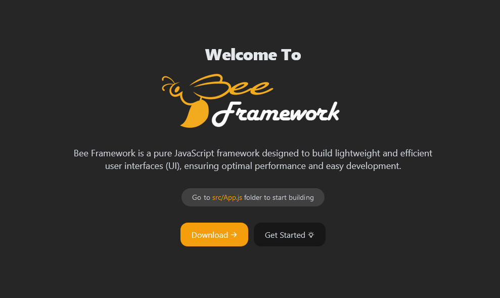

# Bee Framework

Bee Framework is a pure JavaScript framework designed to build lightweight and efficient user interfaces (UI), ensuring optimal performance and easy development. 

## Folder Structure:
```
BeeFramework/
├── public/
│   ├── index.html
│   └── styles.css
├── src/
│    ├── assets/
│    │    └── css/
│    │          └── global.css
│    ├── models/
│    │    └── Model.js
│    ├── routes/
│    │    └── Route.js
│    ├── services/
│    │    └── ApiService.js
│    ├── templates/
│    │    ├── components/
│    │    │    ├── BeeComponent.js
│    │    │    ├── Footer.js
│    │    │    └── Header.js
│    │    ├── pages
│    │    │    ├── Home.js
│    │    │    ├─ About.js
│    │    │    └── 404.js
│    │    └── Layout.js
│    ├── utils/
│    │    └── DomUtils.js
│    └── App.js
├── package.json
├── package-lock.json
├── postcss.config.js
├── tailwind.config.js
├── webpack.config.js
└── yarn.lock
```

## Instalation

```
git clone https://github.com/fitri-hy/bee-framework.git
cd bee-framework
npm install
npm start
```
