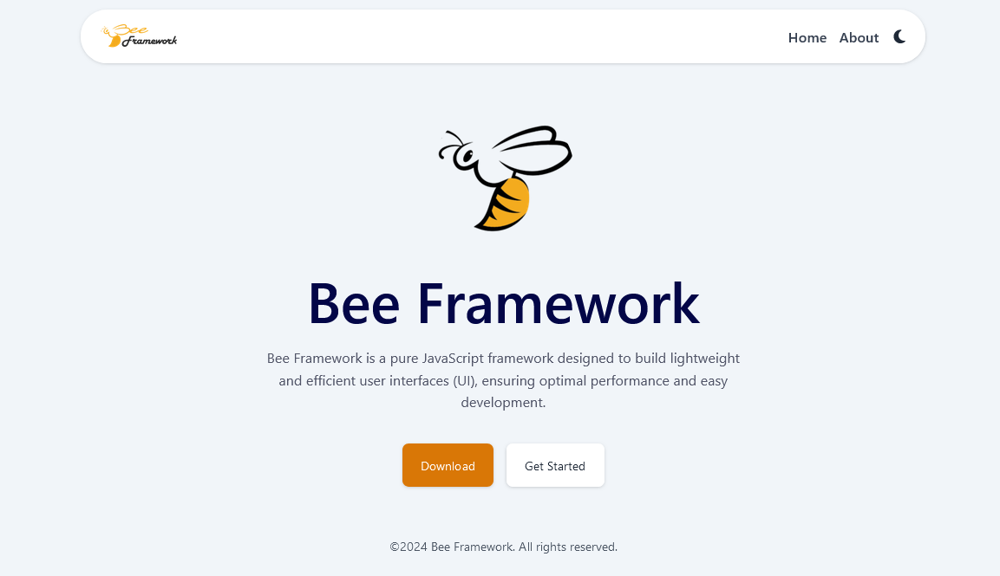

# Bee Framework

Bee Framework is a pure JavaScript framework designed to build lightweight and efficient user interfaces (UI), ensuring optimal performance and easy development. 

## Support
- .js | .jsx | .tsx
- Sass (.scss)
- Tailwind CSS
- AOS (Animation On Scroll)
- Dark / Light Mode
- Routing
- Templating / Layouting
- Api Services
- Any more ...

## Development
```
git clone https://github.com/fitri-hy/bee-framework.git
cd bee-framework
npm install
npm start
```

## Production
- Build project: `npm run build`.
- upload the `dist` folder to your hosting service.
- Open Setup Node.js App
- Set Application startup file: `server.js`

## Using ApiService

- Import ApiService

Import ApiService from the appropriate path in any JavaScript file in your project.

`import ApiService from '../services/ApiService';`

- Use `getData` Method

Use the `getData` method to retrieve data from the given URL.

`const data = await ApiService.getData('https://example.com/api/data');`

- Error Handling (optional)

Add error handling according to your needs.

```
try {
  const data = await ApiService.getData('https://example.com/api/data');
} catch (error) {
  console.error('Failed to fetch data:', error);
}
```

## GET Data From APIService

### - Array Object
```
import BeeComponent from '../components/BeeComponent';
import ApiService from '../../services/ApiService';
import Layout from '../Layout';

class Home extends BeeComponent {
  constructor() {
    super();
    this.data = '';
    this.loading = true;
    this.init();
  }

  async init() {
    this.render();
    try {
      const response = await ApiService.getData('http://api.example/get/data');
      this.data = response || [];
    } catch (error) {
      console.error('Error loading data:', error);
      this.data = [];
    } finally {
      this.loading = false;
      this.render();
    }
  }

  render() {
    const content = this.loading ? this.loadingTemplate() : this.dataTemplate();
    document.getElementById('app').innerHTML = new Layout().render(content);
  }

  loadingTemplate() {
    return `
      <div id="loading" class="absolute inset-0 flex justify-center items-center z-50">
        <div class="bg-white p-5 rounded shadow-lg">
          <p>Memuat Data...</p>
        </div>
      </div>
    `;
  }

  dataTemplate() {
    if (this.data.length > 0) {
      return `
        <section id="dataView" class="py-20">
          <div class="mx-auto w-7/8 flex justify-center items-center h-1/5">
            <div class="w-7/8 mx-auto relative h-full z-30 pt-2 inter">
              ${this.data.map(item => `
                <div class="data-item" id="item-${item.id}">
                  <p>${item.name}</p>
                </div>
              `).join('')}
            </div>
          </div>
        </section>
      `;
    } else {
      return `<p>Error loading data. Please try again later.</p>`;
    }
  }
}

document.addEventListener('DOMContentLoaded', () => {
  new Home();
});

export default Home;
```
### - Objects by ID:
```
// ...
// Script Same as before
// ...

dataTemplate() {
    const itemIdToShow = 2; // Misalnya, kita ingin menampilkan item dengan ID 2
    const selectedItem = this.data.find(item => item.id === itemIdToShow);

    if (selectedItem) {
      return `
        <section id="dataView" class="py-20">
          <div class="mx-auto w-7/8 flex justify-center items-center h-1/5">
            <div class="w-7/8 mx-auto relative h-full z-30 pt-2 inter">
              <div class="data-item" id="item-${selectedItem.id}">
                <p>${selectedItem.name}</p>
              </div>
            </div>
          </div>
        </section>
      `;
    } else {
      return `<p>Error loading data. Item with ID ${itemIdToShow} not found.</p>`;
    }
}

// ...
// Script Same as before
// ...
```
### - Single Object:
```
// ...
// Script Same as before
// ...

async init() {
    this.render();
    try {
        const response = await ApiService.getData('http://api.example/get/data');
        this.data = response.length > 0 ? response[0] : null;
    } catch (error) {
        console.error('Error loading data:', error);
        this.data = null;
    } finally {
        this.loading = false;
        this.render();
    }
}

// ...
// Script Same as before
// ...

dataTemplate() {
    if (this.data) {
        return `
        <section id="dataView" class="py-20">
            <div class="mx-auto w-7/8 flex justify-center items-center h-1/5">
                <div class="w-7/8 mx-auto relative h-full z-30 pt-2 inter">
                    <div class="data-item" id="item-${this.data.id}">
                        <p>${this.data.name}</p>
                    </div>
                </div>
            </div>
        </section>
        `;
    } else {
        return `<p>Error loading data. Please try again later.</p>`;
    }
}

// ...
// Script Same as before
// ...

```


## Using Routing
```
# Path: src/routes/Route.js

import Home from '../templates/pages/Home';
// Add other import pages here ...

import DomUtils from '../utils/DomUtils';

const routes = [
  {
    path: '/',
    component: Home,
    meta: {
      title: 'Welcome to Bee Framework | More Agile and Efficient User Interface',
      description: 'Bee Framework is a pure JavaScript framework designed to build lightweight and efficient user interfaces (UI), ensuring optimal performance and easy development.',
      keywords: 'Bee Framework, JavaScript, user interface, UI, web application, efficient, light, optimal performance'
    }
  },
  // Add another route path here ...
];

// Other scripts ...

export { routes, handleRouteChange };
```

## Using AOS (Animation On Scroll)
- Install AOS (Animation On Scroll) using Yarn, Npm, Bower.
```
yarn add aos
npm install aos --save
bower install aos --save
```
- Open Files: `src/templates/Layout.js`
```
import Header from './components/Header';
import Footer from './components/Footer';
...

// == ADD == //
import AOS from 'aos';
import 'aos/dist/aos.css';

document.addEventListener('DOMContentLoaded', () => {
  AOS.init();
});
// ========= //

class Layout {
...
```
- Add: data-aos="---" to the html element. look at the official site: <a href="https://michalsnik.github.io/aos/">Official AOS</a>.

## Folder Structure:
```
BeeFramework/
├── public/
│   ├── index.html
│   └── styles.css
├── src/
│    ├── assets/
│    │    └── css/
│    │          ├── global.css
│    │          └── style.scss
│    ├── models/
│    │    └── Model.js
│    ├── routes/
│    │    └── Route.js
│    ├── services/
│    │    └── ApiService.js
│    ├── templates/
│    │    ├── components/
│    │    │    ├── BeeComponent.js
│    │    │    ├── DarkMode.js
│    │    │    ├── Footer.js
│    │    │    └── Header.js
│    │    ├── pages
│    │    │    ├── Home.js
│    │    │    ├─ About.js
│    │    │    └── 404.js
│    │    └── Layout.js
│    ├── utils/
│    │    └── DomUtils.js
│    └── App.js
├── package.json
├── package-lock.json
├── postcss.config.js
├── tailwind.config.js
├── webpack.config.js
└── yarn.lock
```
